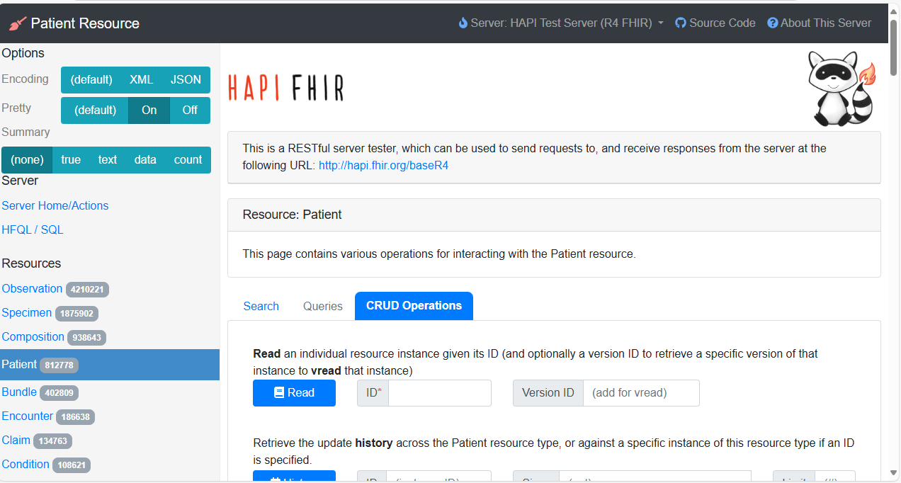
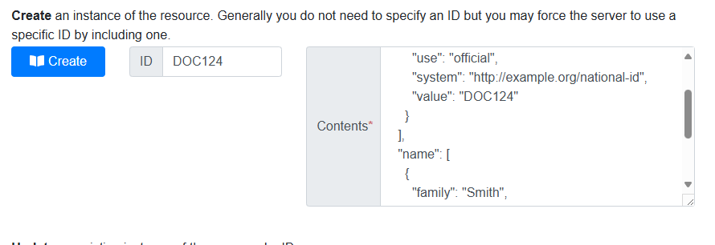
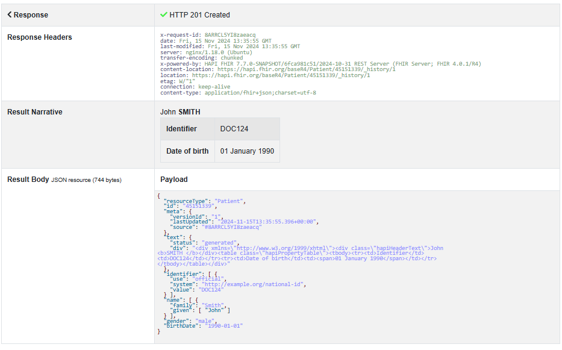
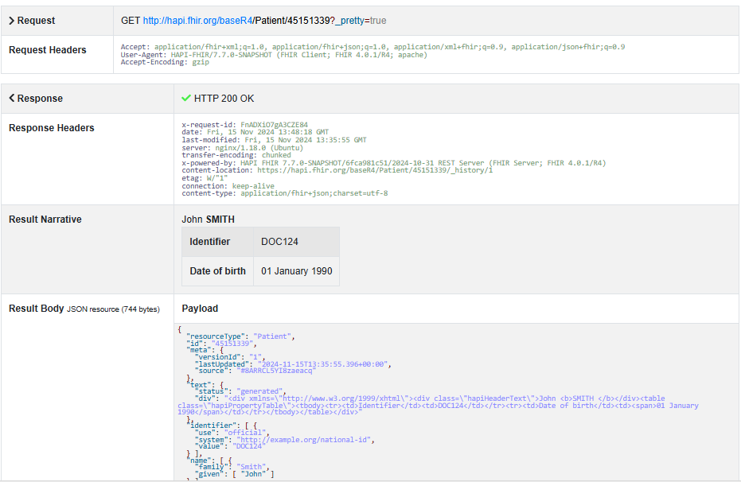
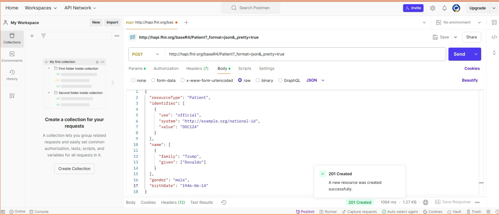
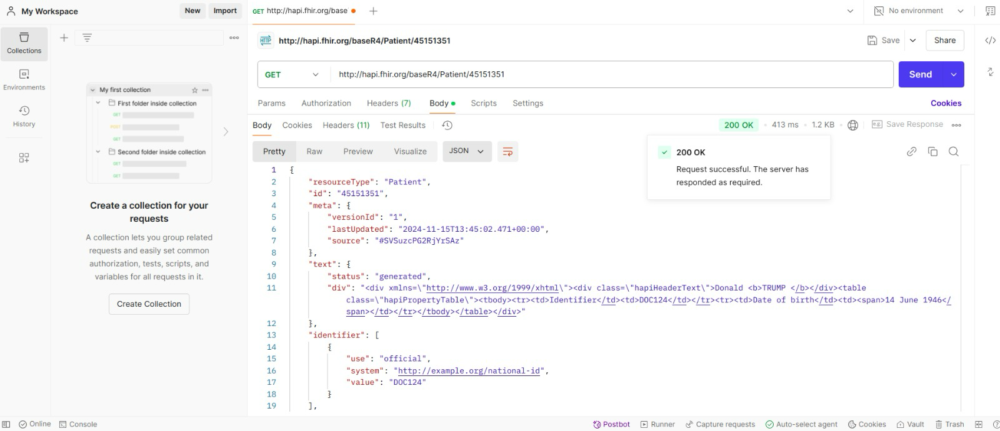

# Trabajo Práctico N°6

## _Autores:_ 
* Gonzalo Grau
* Agustín Luna Simondi

## **PARTE 1:** HAPI FHIR

### 1. a. Crear un recurso patient utilizando la UI del servidor de HAPI FHIR. Leer el recurso patient creado.

### 2. b. Describir brevemente las propiedades del mismo.

## **PARTE 2:** POSTMAN

### 1. a.  Repetir lo anterior utilizando postman online. Luego, leer el recurso creado.

## **PARTE 3:** PYTHON

## 3. a. ~

