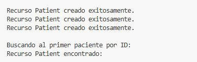

# Trabajo Práctico N°6


## _Autores:_ 
* Gonzalo Grau
* Agustín Luna Simondi

## **PARTE 1:** HAPI FHIR

Ingresamos a la pagina de HAPI FHIR a traves del link otorgada por la catedra. Lo primero que debemos hacer es 
dirigirnos a la solapa de paciente y de ahi a la solapa de CRUD operations que nos permitira manejar las
diferentes herramientas de una API del tipo REST

### 1. a. Crear un recurso patient utilizando la UI del servidor de HAPI FHIR. Leer el recurso patient creado.
Una vez ya marcada la solapa anterior tenemos varias opciones en donde en este caso debemos ir a la sección de "Create", en donde nos permitira crear un recurso de tipo "Paciente"


Elegimos un ID para identificarlo de manera univoca en donde seleccionamos uno de fantasia "DOC124". Ademas de esto debemos
agregar información del paciente dentro de "Contents" en donde se debe crear un body con formato JSON en donde se debe respetar los atributos especificos del tipo de recurso. Por ejemplo le agregamos a nuestro paciente el año de nacimiento bajo el atributo "birthdate", su genero "genre" y asi se puedo ir creando un perfil mucho mas extenso.
El body creado es el siguiente:

```json
{
  "resourceType": "Patient",
  "identifier": [
    {
      "use": "official",
      "system": "http://example.org/national-id",
      "value": "DOC124"
    }
  ],
  "name": [
    {
      "family": "Smith",
      "given": ["John"]
    }
  ],
  "gender": "male",
  "birthDate": "1990-01-01"
}
```


Podemos ver el uso de la funcionalidad del API REST al hacer el POST del nuevo endpoint que hemos creado del recurso Paciente. También vemos el "Result Body" con datos propios que hemos metido en el JSON asi como otros que los proporciona la creación mediante HAPI FHIR como es el "system"


Aca ya tenemos el recurso generado, en donde vemos la creación correcta del paciente incluyendo datos como el nombre, fecha de nacimiento y genero.

Ademas de esto podemos ver el "Result Body" en donde encontramos datos adicionales que se inicializan al crean un nuevo recursco como puede ser su "id" siendo este 45151339 , algo que tendremos que tener en consideración cuando queramos hacer una busqueda


### 1. b. Lectura del recurso creado.


En primera parte para solicitar una lectura  es necesario indicar el ID pero no el que hemos asignado al paciente por nuestra cuenta sino aquel que crea de anera automatica HAPI FHIR que previamente indicamos como 4515139. Esto permitira
que encontremos la entrada que hemos realizado sin error


Ahora vemos que la accion del API REST es la del GET (a diferencia de antes que hicimos un POST ya que lo estabamos creando). El resto de solapas permanece totalmente igual ya que estaria mostrando el resultado de lectura  mostrnado los Result Narrative y Result Body iguales a los que hemos publicado previamente.


## **PARTE 2:** POSTMAN

### 2. a.  Repetir lo anterior utilizando postman online. Luego, leer el recurso creado.
Repetimos el mismo proceso en POSTMAN


Copiamos la respuesta de la Request porque no se puede ver entera en la pantalla

```json
{
"resourceType": "Patient",
"id": "45151351",
"meta": {
"versionId": "1",
"lastUpdated": "2024-11-15T13:45:02.471+00:00",
"source": "#SVSuzcPG2RjYrSAz"
},
"text": {
"status": "generated",
"div": "<div xmlns=\"http://www.w3.org/1999/xhtml\"><div class=\"hapiHeaderText\">Donald <b>TRUMP </b></div><table class=\"hapiPropertyTable\"><tbody><tr><td>Identifier</td><td>DOC124</td></tr><tr><td>Date of birth</td><td><span>14 June 1946</span></td></tr></tbody></table></div>"
},
"identifier": [ {
"use": "official",
"system": "http://example.org/national-id",
"value": "DOC124"
} ],
"name": [ {
"family": "Trump",
"given": [ "Donald" ]
} ],
"gender": "male",
"birthDate": "1946-06-14"
}
```

Los atributos, datos y organización del JSON  es muy similar al caso de HAPI-FHIR. Nuevamente podemos identificar las caracteristicas del paciente al final del JSON , siendo las primeras mismas mas sobre información del recurso en si , id , almacenamiento, historia de editado, entre otras cosas.

## **PARTE 3:** PYTHON

Para estos puntos hemos dejado todo el codigo dentro del mismo repositorio siguiendo la estructura compartida por las 
profesoras. El unico archvio nuevo creado seria el del punto c en donde se creo el recurso de "Allergy" el cual se puede
encontrar en "allergy.py".

En el workflow2.py se podra correr el codigo en donde se resuleven los puntos a,b y c con uso de las funciones a las que 
llama. Creamos 3 pacientes distintos haciendo uso de la funcion que crea dichos recursos basados en los codigos que 
proporciono la catedra. Además de esto se creo un codigo propio que permitiese hacer busqueda bajo parametros seleccionados,
en este caso buscamos todos los pacientes que tengan genero masculino. Por ultimo también optamos por crear el recurso de Allergy el cual indagamos en la documentación para saber como crearlo y declararlo correctamente.

A continuación compartimos lo que se obtiene al correr el codigo





Creacción de los 3 recursos de pacientes y luego la busqueda del mismo.
Buscamos al primer paciente creado a traves de su id el cual obtenemos una vez que hacemos el POST (Obtenemos el id que nos crea de por si el HAPI FHIR )
Al igual que en los otros ejercicios nos devuelvo el Result Body en un formato JSON. Si bien no es una maera muy estetica de mostrarla, podemos 
identificar las diversos atributos del recurso como el nombre, ID, fecha de nacimiento, entre otros lo que permite identificar al sujeto en cuestión.


Podemos ver que claramente hay varios recursos de pacientes con genero masculino porlo que se muestran solamente los 
20 primeros encontrados (algo que tambipen ocurre en la pagina de HAPI FHIR)

### Creación de recurso
En este trabajo decidimos crear el recurso de "Allergy" al igual que en los otros codigos todo desde Python. Para el codigo en si que se encuentra en "allergy.py" vamos a utilizar las funciones creadas en "base2.py"  para hacer tanto el POST como el GET del recurso y además poder asociarlo con un paciente que previamente creamos ( que seria John Smith). El codigo principal es el siguiente:

```python
  def create_allergy(patient_id, substance, reaction, severity):
      allergy = AllergyIntolerance(patient=Reference(reference=f"Patient/{patient_id}"),
                                      code={"text": substance},
                                      reaction=[{"manifestation": [{"text": reaction}],
                                                  "severity": severity,
                                                  "substance": {"text": substance}}])
      return allergy
```

En una primera parte definimos la función para poder crear el recurso en si en donde utilizamos la funcion "AllergyIntolerance" proveniente de la biblioteca de FHIR. Para poder trabajr con este tuvimos que indagar sobre la documentación para saber que parametros permitia y cuales debian ingresarse de manera obligatoria (como el caso de referencia al paciente)

#### Atributos
*patient: Se hace una referencia al paciente para poder asociar el recurso , de esta manera se pasa algun atributo que lo pueda identificar de manera univoca como es el caso del ID creado por FHIR al incializar el recurso de Paciente

*code : En este caso el codigo haria referencia a un codigo unico de la alergia asi como seria el caso de SNOMED. Como admite texto (dado que la clave númerica que utiliza puede manipularse como un string) podemos directamente reutilizar el nombre de la sustancia en caso de no saber el codigo o mismo al ser un caso de fantasia

*reaction : Posee 3 campos diferentes siendo estos "manifestation", "seeverity" y "substance". La manifestación de tipo texto (al igual que el caso de la substancia) alude a la reacción en si que produce la substancia responsable de la alergia. Por ejemplo esto podria ser, sudor, picazón, ceguera, entre otros. Por otro lado la severidad alude a la gravedad de la manifestación y este tiene valores restringidos (por esta razón no vemos el campo de texto). Estos valores son "mild", "moderate" y "severe". Finalmente substance refiere a la substancia en si responsable de producir la alergia.

### Workflow del recurso creado

```python
  if __name__ == '__main__':
      allergy = create_allergy("45151396", "Yerba Mate", "Rash", "severe")
      allergy_id = send_resource_to_hapi_fhir(allergy, "AllergyIntolerance")
      if allergy_id:
          print(f"ID del recurso Allergy Intolerance creado: {allergy_id}")
          get_resource_from_hapi_fhir(allergy_id, "AllergyIntolerance")
```

Creamos el recurso asociandolo con el paciente John Smith utilizando su ID. Como podemos notar este mismo tiene una alergia a la Yerba Mate severa que le produce un sarpullido. Posteriormente se hace el POST del recurso de AllergyIntolerance y se obtiene el ID generado por FHIR. Finalmente en caso de exito se muestra el ID creado y se obtiene los datos del mismo al hacer un GET utilizando el mismo ID creado


